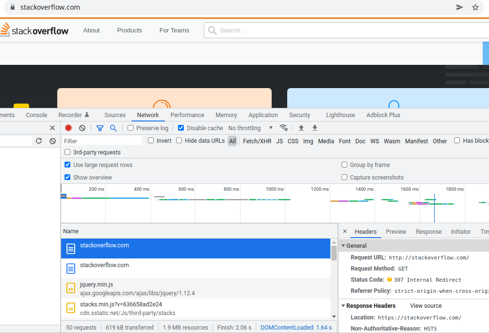
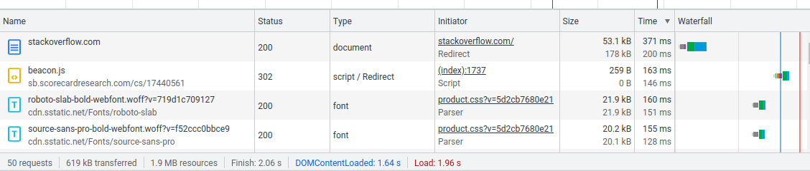
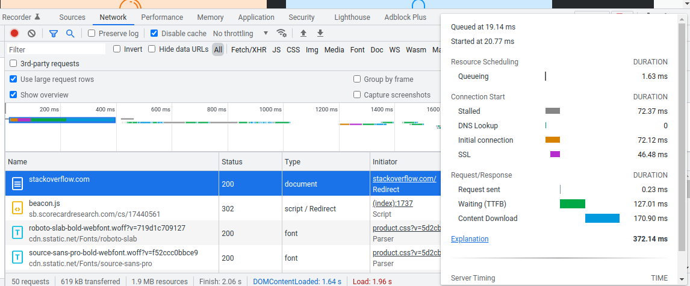

# Домашнее задание к занятию "3.6. Компьютерные сети, лекция 1"


###  1. Работа c HTTP через телнет.

Получили код ответа 301 - документ перемещён в другое место: https://stackoverflow.com/questions

````
$ telnet stackoverflow.com 80
Trying 151.101.129.69...
Connected to stackoverflow.com.
Escape character is '^]'.
GET /questions HTTP/1.0
HOST: stackoverflow.com

HTTP/1.1 301 Moved Permanently
cache-control: no-cache, no-store, must-revalidate
location: https://stackoverflow.com/questions
x-request-guid: 6487c3bd-4226-409f-8aae-d54ce065c368
feature-policy: microphone 'none'; speaker 'none'
content-security-policy: upgrade-insecure-requests; frame-ancestors 'self' https://stackexchange.com
Accept-Ranges: bytes
Date: Thu, 10 Feb 2022 19:21:51 GMT
Via: 1.1 varnish
Connection: close
X-Served-By: cache-fra19135-FRA
X-Cache: MISS
X-Cache-Hits: 0
X-Timer: S1644520912.908296,VS0,VE85
Vary: Fastly-SSL
X-DNS-Prefetch-Control: off
Set-Cookie: prov=65b618bb-64cb-5b4d-93bb-d0f38d157b46; domain=.stackoverflow.com; expires=Fri, 01-Jan-2055 00:00:00 GMT; path=/; HttpOnly

Connection closed by foreign host.
````

### 2. Повторите задание 1 в браузере, используя консоль разработчика F12.

Укажите в ответе полученный HTTP код.

`307 - внутренний редирект`

Проверьте время загрузки страницы, какой запрос обрабатывался дольше всего?
`Request URL: https://stackoverflow.com/ - 372 ms`

                                                                                                                                        
                                                                                                                                          



### 3. Какой IP адрес у вас в интернете?


 `46.138.128.251`


### 4. Какому провайдеру принадлежит ваш IP адрес? Какой автономной системе AS? Воспользуйтесь утилитой `whois`

Провайдер: `МГТС`

Номер автономной системы: `AS25513`

````
$ whois 46.138.128.251
% This is the RIPE Database query service.
% The objects are in RPSL format.
%
% The RIPE Database is subject to Terms and Conditions.
% See http://www.ripe.net/db/support/db-terms-conditions.pdf

% Note: this output has been filtered.
%       To receive output for a database update, use the "-B" flag.

% Information related to '46.138.128.0 - 46.138.135.255'

% Abuse contact for '46.138.128.0 - 46.138.135.255' is 'abuse@spd-mgts.ru'

inetnum:        46.138.128.0 - 46.138.135.255
netname:        MGTS-PPPOE
descr:          Moscow Local Telephone Network (OAO MGTS)
country:        RU
admin-c:        USPD-RIPE
tech-c:         USPD-RIPE
status:         ASSIGNED PA
mnt-by:         MGTS-USPD-MNT
created:        2011-11-17T14:41:54Z
last-modified:  2011-11-17T14:41:54Z
source:         RIPE

role:           PJSC Moscow City Telephone Network NOC
address:        USPD MGTS
address:        Moscow, Russia
address:        Khachaturyana 5
admin-c:        AGS9167-RIPE
admin-c:        AVK103-RIPE
admin-c:        GIA45-RIPE
tech-c:         AVK103-RIPE
tech-c:         VMK
tech-c:         ANO3-RIPE
abuse-mailbox:  abuse@spd-mgts.ru
nic-hdl:        USPD-RIPE
mnt-by:         MGTS-USPD-MNT
created:        2006-09-11T07:56:01Z
last-modified:  2021-04-13T10:41:35Z
source:         RIPE # Filtered

% Information related to '46.138.0.0/16AS25513'

route:          46.138.0.0/16
descr:          Moscow Local Telephone Network (PJSC MGTS)
descr:          Moscow, Russia
origin:         AS25513
mnt-by:         MGTS-USPD-MNT
created:        2010-11-29T19:47:08Z
last-modified:  2020-01-13T10:32:12Z
source:         RIPE

% This query was served by the RIPE Database Query Service version 1.102.2 (HEREFORD)
````


### 5. Через какие сети проходит пакет, отправленный с вашего компьютера на адрес 8.8.8.8? Через какие AS? Воспользуйтесь утилитой `traceroute`

````
 $ sudo traceroute -An 8.8.8.8
traceroute to 8.8.8.8 (8.8.8.8), 30 hops max, 60 byte packets
 1  192.168.1.254 [*]  0.459 ms  0.752 ms  1.053 ms
 2  100.124.0.1 [*]  9.100 ms  9.085 ms  9.306 ms
 3  212.188.1.6 [AS8359]  9.059 ms  9.093 ms  9.175 ms
 4  212.188.1.5 [AS8359]  9.317 ms  9.339 ms *
 5  195.34.53.206 [AS8359]  9.386 ms  9.522 ms  9.598 ms
 6  212.188.29.82 [AS8359]  10.735 ms  4.206 ms  5.291 ms
 7  108.170.250.66 [AS15169]  5.698 ms 108.170.250.146 [AS15169]  5.340 ms 108.170.250.113 [AS15169]  5.207 ms
 8  * 142.251.49.158 [AS15169]  20.837 ms 209.85.255.136 [AS15169]  23.253 ms
 9  108.170.235.64 [AS15169]  20.706 ms 108.170.235.204 [AS15169]  23.442 ms 216.239.57.222 [AS15169]  23.789 ms
10  216.239.57.5 [AS15169]  22.921 ms 108.170.233.161 [AS15169]  20.325 ms 142.250.233.27 [AS15169]  20.973 ms
11  * * *
12  * * *
13  * * *
14  * * *
15  * * *
16  * * *
17  * * *
18  8.8.8.8 [AS15169]  21.860 ms  19.023 ms *
````


### 6. Повторите задание 5 в утилите mtr. На каком участке наибольшая задержка - delay?

На 9 хопе наибольшая задержка
````
$ sudo mtr --report 8.8.8.8
Start: 2022-02-10T23:00:50+0300
HOST: ZX-Spectrum-64K             Loss%   Snt   Last   Avg  Best  Wrst StDev
  1.|-- _gateway                   0.0%    10    0.5   0.5   0.4   0.6   0.1
  2.|-- 100.124.0.1                0.0%    10    7.6   5.1   3.0   7.6   1.8
  3.|-- mpts-ss-51.msk.mts-intern  0.0%    10    3.1   2.7   2.5   3.1   0.2
  4.|-- mag9-cr03-be12.51.msk.mts 20.0%    10    3.3   5.2   3.0  20.0   6.0
  5.|-- mag9-cr02-be13.77.msk.mts 40.0%    10    3.8   3.5   3.1   3.8   0.3
  6.|-- mag9-cr01-be16.77.msk.mts  0.0%    10    3.2   3.2   2.6   3.5   0.3
  7.|-- 108.170.250.130            0.0%    10    4.5   4.6   4.4   5.3   0.3
  8.|-- 209.85.255.136            40.0%    10   21.5  21.6  21.4  22.1   0.3
  9.|-- 209.85.254.20              0.0%    10   21.9  21.8  21.6  22.0   0.1
 10.|-- 209.85.254.135             0.0%    10   21.6  22.2  21.6  23.0   0.5
 11.|-- ???                       100.0    10    0.0   0.0   0.0   0.0   0.0
 12.|-- ???                       100.0    10    0.0   0.0   0.0   0.0   0.0
 13.|-- ???                       100.0    10    0.0   0.0   0.0   0.0   0.0
 14.|-- ???                       100.0    10    0.0   0.0   0.0   0.0   0.0
 15.|-- ???                       100.0    10    0.0   0.0   0.0   0.0   0.0
 16.|-- ???                       100.0    10    0.0   0.0   0.0   0.0   0.0
 17.|-- ???                       100.0    10    0.0   0.0   0.0   0.0   0.0
 18.|-- ???                       100.0    10    0.0   0.0   0.0   0.0   0.0
 19.|-- ???                       100.0    10    0.0   0.0   0.0   0.0   0.0
 20.|-- dns.google                30.0%    10   20.8  20.4  18.0  21.0   1.1
````

### 7. Какие DNS сервера отвечают за доменное имя dns.google? Какие A записи? воспользуйтесь утилитой `dig`

````
$ dig NS +short dns.google
ns2.zdns.google.
ns1.zdns.google.
ns3.zdns.google.
ns4.zdns.google.
````

````
$ dig A +short dns.google
8.8.8.8
8.8.4.4
````


### 8. Проверьте PTR записи для IP адресов из задания 7. Какое доменное имя привязано к IP? воспользуйтесь утилитой `dig`

````
$ dig -x 8.8.8.8        

; <<>> DiG 9.11.3-1ubuntu1.16-Ubuntu <<>> -x 8.8.8.8
;; global options: +cmd
;; Got answer:
;; ->>HEADER<<- opcode: QUERY, status: NOERROR, id: 7869
;; flags: qr rd ra; QUERY: 1, ANSWER: 1, AUTHORITY: 0, ADDITIONAL: 1

;; OPT PSEUDOSECTION:
; EDNS: version: 0, flags:; udp: 65494
;; QUESTION SECTION:
;8.8.8.8.in-addr.arpa.          IN      PTR

;; ANSWER SECTION:
8.8.8.8.in-addr.arpa.   6236    IN      PTR     dns.google.
````

````
$ dig -x 8.8.4.4

; <<>> DiG 9.11.3-1ubuntu1.16-Ubuntu <<>> -x 8.8.4.4
;; global options: +cmd
;; Got answer:
;; ->>HEADER<<- opcode: QUERY, status: NOERROR, id: 57893
;; flags: qr rd ra; QUERY: 1, ANSWER: 1, AUTHORITY: 0, ADDITIONAL: 1

;; OPT PSEUDOSECTION:
; EDNS: version: 0, flags:; udp: 65494
;; QUESTION SECTION:
;4.4.8.8.in-addr.arpa.          IN      PTR

;; ANSWER SECTION:
4.4.8.8.in-addr.arpa.   65454   IN      PTR     dns.google.

````


