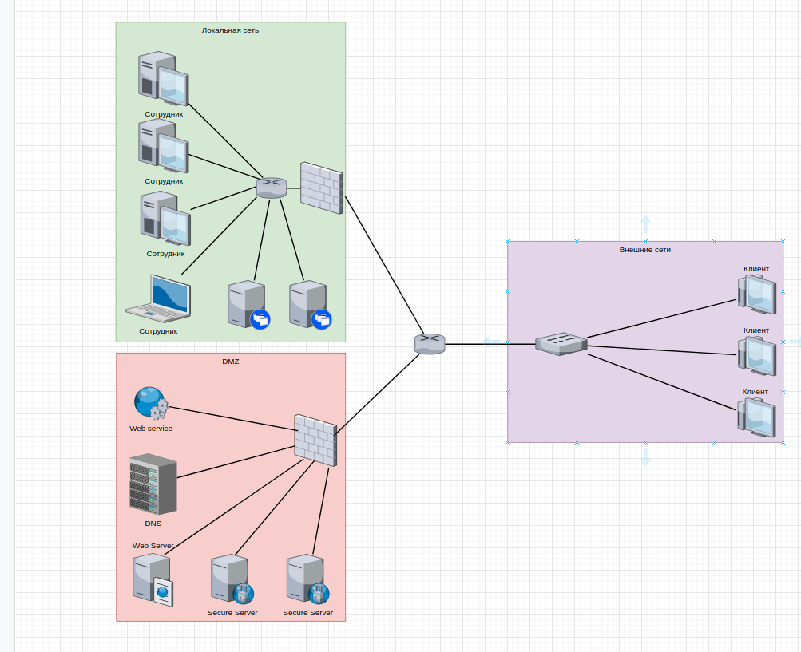

# Домашнее задание к занятию "3.8. Компьютерные сети, лекция 3"


###  1. Подключитесь к публичному маршрутизатору в интернет. Найдите маршрут к вашему публичному IP

Если делать строго по заданию, то получаем:

````
route-views>show ip route 46.138.128.251/32
                                        ^
% Invalid input detected at '^' marker.
route-views>show bgp 46.138.128.251/32     
% Network not in table
````

Если убрать маску сети, то уже лучше:
````
                                                                                                                                    
route-views>show ip route 46.138.128.251                                                                                               

Routing entry for 46.138.0.0/16                                                                                                        
  Known via "bgp 6447", distance 20, metric 0                                                                                          
  Tag 2497, type external                                                                                                              
  Last update from 202.232.0.2 1d20h ago                                                                                               
  Routing Descriptor Blocks:                                                                                                           
  * 202.232.0.2, from 202.232.0.2, 1d20h ago                                                                                           
      Route metric is 0, traffic share count is 1                                                                                      
      AS Hops 3                                                                                                                        
      Route tag 2497                                                                                                                   
      MPLS label: none                                                                                                                 


route-views>show bgp 46.138.128.251

BGP routing table entry for 46.138.0.0/16, version 307579354
Paths: (23 available, best #18, table default)
  Not advertised to any peer
  Refresh Epoch 1
  6939 8359 25513
    64.71.137.241 from 64.71.137.241 (216.218.252.164)
      Origin IGP, localpref 100, valid, external
      path 7FE165050D08 RPKI State not found
      rx pathid: 0, tx pathid: 0
  Refresh Epoch 1
  3549 3356 8359 25513
    208.51.134.254 from 208.51.134.254 (67.16.168.191)
      Origin IGP, metric 0, localpref 100, valid, external
      Community: 0:199 3356:2 3356:22 3356:100 3356:123 3356:507 3356:903 3356:2111 3549:2581 3549:30840 8359:100 8359:5500 8359:55277
      path 7FE13E20BB78 RPKI State not found
      rx pathid: 0, tx pathid: 0
  Refresh Epoch 1
  701 3356 8359 25513
    137.39.3.55 from 137.39.3.55 (137.39.3.55)
      Origin IGP, localpref 100, valid, external
      path 7FE1786D2B48 RPKI State not found
      rx pathid: 0, tx pathid: 0
  Refresh Epoch 1
  53767 14315 6453 6453 3356 8359 25513
    162.251.163.2 from 162.251.163.2 (162.251.162.3)
      Origin IGP, localpref 100, valid, external
      Community: 14315:5000 53767:5000
      path 7FE10E97D568 RPKI State not found
      rx pathid: 0, tx pathid: 0
  Refresh Epoch 1
  3356 8359 25513
    4.68.4.46 from 4.68.4.46 (4.69.184.201)
      Origin IGP, metric 0, localpref 100, valid, external
      Community: 0:199 3356:2 3356:22 3356:100 3356:123 3356:507 3356:903 3356:2111 8359:100 8359:5500 8359:55277
      path 7FE02929DD18 RPKI State not found
      rx pathid: 0, tx pathid: 0
  Refresh Epoch 1
  8283 8359 25513
    94.142.247.3 from 94.142.247.3 (94.142.247.3)
      Origin IGP, metric 0, localpref 100, valid, external
      Community: 0:199 8283:1 8283:101 8359:100 8359:5500 8359:55277
      unknown transitive attribute: flag 0xE0 type 0x20 length 0x18
        value 0000 205B 0000 0000 0000 0001 0000 205B
              0000 0005 0000 0001 
      path 7FE02EB69B68 RPKI State not found
      rx pathid: 0, tx pathid: 0
  Refresh Epoch 1
  4901 6079 8359 25513
    162.250.137.254 from 162.250.137.254 (162.250.137.254)
      Origin IGP, localpref 100, valid, external
      Community: 65000:10100 65000:10300 65000:10400
      path 7FE16CABA828 RPKI State not found
      rx pathid: 0, tx pathid: 0
  Refresh Epoch 1
  57866 3356 8359 25513
    37.139.139.17 from 37.139.139.17 (37.139.139.17)
      Origin IGP, metric 0, localpref 100, valid, external
      Community: 0:199 3356:2 3356:22 3356:100 3356:123 3356:507 3356:903 3356:2111 8359:100 8359:5500 8359:55277
      path 7FE1549E7448 RPKI State not found
      rx pathid: 0, tx pathid: 0
  Refresh Epoch 1
  852 3356 8359 25513
    154.11.12.212 from 154.11.12.212 (96.1.209.43)
      Origin IGP, metric 0, localpref 100, valid, external
      path 7FE17EC94908 RPKI State not found
      rx pathid: 0, tx pathid: 0
  Refresh Epoch 1
  20912 3257 3356 8359 25513
    212.66.96.126 from 212.66.96.126 (212.66.96.126)
      Origin IGP, localpref 100, valid, external
      Community: 3257:8070 3257:30515 3257:50001 3257:53900 3257:53902 20912:65004
      path 7FE17286E608 RPKI State not found
      rx pathid: 0, tx pathid: 0
  Refresh Epoch 1
  3303 8359 25513
    217.192.89.50 from 217.192.89.50 (138.187.128.158)
      Origin IGP, localpref 100, valid, external
      Community: 0:199 3303:1004 3303:1006 3303:1030 3303:3054 8359:100 8359:5500 8359:55277
      path 7FE011A64CA0 RPKI State not found
      rx pathid: 0, tx pathid: 0
  Refresh Epoch 1
  3333 8359 25513
    193.0.0.56 from 193.0.0.56 (193.0.0.56)
      Origin IGP, localpref 100, valid, external
      Community: 0:199 8359:100 8359:5500 8359:55277
      path 7FE14A99B6E8 RPKI State not found
      rx pathid: 0, tx pathid: 0
  Refresh Epoch 1
  7018 3356 8359 25513
    12.0.1.63 from 12.0.1.63 (12.0.1.63)
      Origin IGP, localpref 100, valid, external
      Community: 7018:5000 7018:37232
      path 7FE04AE3F850 RPKI State not found
      rx pathid: 0, tx pathid: 0
  Refresh Epoch 1
  3561 3910 3356 8359 25513
    206.24.210.80 from 206.24.210.80 (206.24.210.80)
      Origin IGP, localpref 100, valid, external
      path 7FE0E85E41C8 RPKI State not found
      rx pathid: 0, tx pathid: 0
  Refresh Epoch 1
  1351 8359 25513
    132.198.255.253 from 132.198.255.253 (132.198.255.253)
      Origin IGP, localpref 100, valid, external
      path 7FE12A3677E8 RPKI State not found
      rx pathid: 0, tx pathid: 0
  Refresh Epoch 1
  20130 6939 8359 25513
    140.192.8.16 from 140.192.8.16 (140.192.8.16)
      Origin IGP, localpref 100, valid, external
      path 7FE0E6197DF8 RPKI State not found
      rx pathid: 0, tx pathid: 0
  Refresh Epoch 1
  101 3356 8359 25513
    209.124.176.223 from 209.124.176.223 (209.124.176.223)
      Origin IGP, localpref 100, valid, external
      Community: 0:199 101:20100 101:20110 101:22100 3356:2 3356:22 3356:100 3356:123 3356:507 3356:903 3356:2111 8359:100 8359:5500 8359:55277
      Extended Community: RT:101:22100
      path 7FE13B8F9D50 RPKI State not found
      rx pathid: 0, tx pathid: 0
  Refresh Epoch 2
  2497 8359 25513
    202.232.0.2 from 202.232.0.2 (58.138.96.254)
      Origin IGP, localpref 100, valid, external, best
      path 7FE0EF491580 RPKI State not found
      rx pathid: 0, tx pathid: 0x0
  Refresh Epoch 1
  7660 2516 1299 8359 25513
    203.181.248.168 from 203.181.248.168 (203.181.248.168)
      Origin IGP, localpref 100, valid, external
      Community: 2516:1030 7660:9003
      path 7FE04DFAE048 RPKI State not found
      rx pathid: 0, tx pathid: 0
  Refresh Epoch 1
  3257 3356 8359 25513
    89.149.178.10 from 89.149.178.10 (213.200.83.26)
      Origin IGP, metric 10, localpref 100, valid, external
      Community: 3257:8794 3257:30043 3257:50001 3257:54900 3257:54901
      path 7FE0F2D53388 RPKI State not found
      rx pathid: 0, tx pathid: 0
  Refresh Epoch 1
  49788 12552 8359 25513
    91.218.184.60 from 91.218.184.60 (91.218.184.60)
      Origin IGP, localpref 100, valid, external
      Community: 12552:12000 12552:12100 12552:12101 12552:22000
      Extended Community: 0x43:100:1
      path 7FE0FC0C8250 RPKI State not found
      rx pathid: 0, tx pathid: 0
  Refresh Epoch 1
  1221 4637 3356 8359 25513
    203.62.252.83 from 203.62.252.83 (203.62.252.83)
      Origin IGP, localpref 100, valid, external
      path 7FE164D86D88 RPKI State not found
      rx pathid: 0, tx pathid: 0
  Refresh Epoch 1
  19214 3257 3356 8359 25513
    208.74.64.40 from 208.74.64.40 (208.74.64.40)
      Origin IGP, localpref 100, valid, external
      Community: 3257:8108 3257:30048 3257:50002 3257:51200 3257:51203
      path 7FE00ADFB2A8 RPKI State not found
      rx pathid: 0, tx pathid: 0
````

### 2. Создайте dummy0 интерфейс в Ubuntu. Добавьте несколько статических маршрутов. Проверьте таблицу маршрутизации.

Конфигурация перед настройкой dummy:
````
root@netology1:~# ip a 
1: lo: <LOOPBACK,UP,LOWER_UP> mtu 65536 qdisc noqueue state UNKNOWN group default qlen 1000
    link/loopback 00:00:00:00:00:00 brd 00:00:00:00:00:00
    inet 127.0.0.1/8 scope host lo
       valid_lft forever preferred_lft forever
    inet6 ::1/128 scope host 
       valid_lft forever preferred_lft forever
2: eth0: <BROADCAST,MULTICAST,UP,LOWER_UP> mtu 1500 qdisc fq_codel state UP group default qlen 1000
    link/ether 08:00:27:b1:28:5d brd ff:ff:ff:ff:ff:ff
    inet 10.0.2.15/24 brd 10.0.2.255 scope global dynamic eth0
       valid_lft 83424sec preferred_lft 83424sec
    inet6 fe80::a00:27ff:feb1:285d/64 scope link 
       valid_lft forever preferred_lft forever
3: eth1: <BROADCAST,MULTICAST,UP,LOWER_UP> mtu 1500 qdisc fq_codel state UP group default qlen 1000
    link/ether 08:00:27:e8:e8:f5 brd ff:ff:ff:ff:ff:ff
    inet 172.28.128.10/24 scope global eth1
       valid_lft forever preferred_lft forever
    inet6 fe80::a00:27ff:fee8:e8f5/64 scope link 
       valid_lft forever preferred_lft forever
root@netology1:~# ip -br route
default via 10.0.2.2 dev eth0 proto dhcp src 10.0.2.15 metric 100 
10.0.2.0/24 dev eth0 proto kernel scope link src 10.0.2.15 
10.0.2.2 dev eth0 proto dhcp scope link src 10.0.2.15 metric 100 
172.28.128.0/24 dev eth1 proto kernel scope link src 172.28.128.10 
````

Выполняем задание:

````
root@netology1:~# modprobe dummy

root@netology1:~# ip link add dummy0 type dummy   

root@netology1:~# ip link show dummy0
4: dummy0: <BROADCAST,NOARP> mtu 1500 qdisc noop state DOWN mode DEFAULT group default qlen 1000
    link/ether fa:cf:33:da:16:7b brd ff:ff:ff:ff:ff:ff
root@netology1:~# ip addr add 192.168.1.100/24 brd + dev dummy0

root@netology1:~# ip a
1: lo: <LOOPBACK,UP,LOWER_UP> mtu 65536 qdisc noqueue state UNKNOWN group default qlen 1000
    link/loopback 00:00:00:00:00:00 brd 00:00:00:00:00:00
    inet 127.0.0.1/8 scope host lo
       valid_lft forever preferred_lft forever
    inet6 ::1/128 scope host 
       valid_lft forever preferred_lft forever
2: eth0: <BROADCAST,MULTICAST,UP,LOWER_UP> mtu 1500 qdisc fq_codel state UP group default qlen 1000
    link/ether 08:00:27:b1:28:5d brd ff:ff:ff:ff:ff:ff
    inet 10.0.2.15/24 brd 10.0.2.255 scope global dynamic eth0
       valid_lft 83131sec preferred_lft 83131sec
    inet6 fe80::a00:27ff:feb1:285d/64 scope link 
       valid_lft forever preferred_lft forever
3: eth1: <BROADCAST,MULTICAST,UP,LOWER_UP> mtu 1500 qdisc fq_codel state UP group default qlen 1000
    link/ether 08:00:27:e8:e8:f5 brd ff:ff:ff:ff:ff:ff
    inet 172.28.128.10/24 scope global eth1
       valid_lft forever preferred_lft forever
    inet6 fe80::a00:27ff:fee8:e8f5/64 scope link 
       valid_lft forever preferred_lft forever
4: dummy0: <BROADCAST,NOARP> mtu 1500 qdisc noop state DOWN group default qlen 1000
    link/ether fa:cf:33:da:16:7b brd ff:ff:ff:ff:ff:ff
    inet 192.168.1.100/24 brd 192.168.1.255 scope global dummy0
       valid_lft forever preferred_lft forever
 
root@netology1:~# ip link set dev dummy0 up

root@netology1:~# ip route add 192.168.1.0/24 dev dummy0

root@netology1:~# ip r
default via 10.0.2.2 dev eth0 proto dhcp src 10.0.2.15 metric 100 
10.0.2.0/24 dev eth0 proto kernel scope link src 10.0.2.15 
10.0.2.2 dev eth0 proto dhcp scope link src 10.0.2.15 metric 100 
172.28.128.0/24 dev eth1 proto kernel scope link src 172.28.128.10 
192.168.1.0/24 dev dummy0 proto kernel scope link src 192.168.1.100
````

Примечание: Это всё надо делать через конфигурационные файлы, чтобы интерфейсы поднимались при загрузке.


### 3. Проверьте открытые TCP порты в Ubuntu, какие протоколы и приложения используют эти порты? Приведите несколько примеров.

Воспользуемся командой `ss`

````
root@netology1:~# ss -tap
State            Recv-Q           Send-Q                       Local Address:Port                         Peer Address:Port            Process                                                                                                                                
LISTEN           0                511                                0.0.0.0:http                              0.0.0.0:*                users:(("nginx",pid=4663,fd=6),("nginx",pid=4662,fd=6),("nginx",pid=4661,fd=6))                                                       
LISTEN           0                4096                         127.0.0.53%lo:domain                            0.0.0.0:*                users:(("systemd-resolve",pid=591,fd=13))                                                                                             
LISTEN           0                128                                0.0.0.0:ssh                               0.0.0.0:*                users:(("sshd",pid=794,fd=3))                                                                                                         
ESTAB            0                0                                10.0.2.15:ssh                              10.0.2.2:35284            users:(("sshd",pid=26376,fd=4),("sshd",pid=26327,fd=4))                                                                               
LISTEN           0                511                                   [::]:http                                 [::]:*                users:(("nginx",pid=4663,fd=7),("nginx",pid=4662,fd=7),("nginx",pid=4661,fd=7))                                                       
LISTEN           0                128                                   [::]:ssh                                  [::]:*                users:(("sshd",pid=794,fd=4))
````
Видим, что TCP-порты у нас используют sshd - 22-й, nginx - 80-й и systemd-resolve (DNS) - 53-й


### 4. Проверьте используемые UDP сокеты в Ubuntu, какие протоколы и приложения используют эти порты?

````
oot@netology1:~# ss -lup
State      Recv-Q     Send-Q          Local Address:Port           Peer Address:Port    Process                                        
UNCONN     0          0               127.0.0.53%lo:domain              0.0.0.0:*        users:(("systemd-resolve",pid=591,fd=12))     
UNCONN     0          0              10.0.2.15%eth0:bootpc              0.0.0.0:*        users:(("systemd-network",pid=589,fd=17))     
````
Видим, что UDP-порты у нас используют dhcp-клиент - 68-й и systemd-resolve (DNS) - 53-й

### 5. Используя diagrams.net, создайте L3 диаграмму вашей домашней сети или любой другой сети, с которой вы работали.

 


### 6* Установите Nginx, настройте в режиме балансировщика TCP или UDP.

`root@vagrant:/etc/nginx# cat nginx.conf`

````
user www-data;
worker_processes auto;
pid /run/nginx.pid;
include /etc/nginx/modules-enabled/*.conf;

events {
        worker_connections 768;
        # multi_accept on;
}

http {

        sendfile on;
        tcp_nopush on;
        tcp_nodelay on;
        keepalive_timeout 65;
        types_hash_max_size 2048;

        include /etc/nginx/mime.types;
        default_type application/octet-stream;

        access_log /var/log/nginx/access.log;
        error_log /var/log/nginx/error.log;

        gzip on;

        include /etc/nginx/conf.d/*.conf;
        include /etc/nginx/sites-enabled/*;
}

stream {

    server {
        listen 5432 so_keepalive=on;
        proxy_pass tcp_postgresql;
    }

    upstream tcp_postgresql {
        server 10.0.2.200:5432;
        server 10.0.2.201:5432;
    }


    server {
        listen 53 udp;
        proxy_pass udp_dns;
        proxy_responses 1;
    }

    upstream udp_dns {
        server 10.0.2.1:53;
        server 10.0.2.2:53;
    }
}
````

`root@vagrant:/etc/nginx/sites-available# cat upstream` 

````
server {
        listen 80 default_server;
        listen [::]:80 default_server;

#       root /var/www/html;

        server_name _;

        location / {
            proxy_pass http://netology_backend;
            proxy_set_header   Host             $host;
            proxy_set_header   X-Real-IP        $remote_addr;
            proxy_set_header   X-Forwarded-For  $proxy_add_x_forwarded_for;
        }

        location /page1 {
            proxy_pass http://backend1;
        }

        location /page2 {
            proxy_pass http://backend2;
        }

}


upstream netology_backend {
    server 10.0.2.101;
    server 10.0.2.102;
    server 10.0.2.103;
}

upstream backend1 {
    server 10.0.2.104;
    server 10.0.2.105;
}

upstream backend2 {
    server 10.0.2.106;
    server 10.0.2.107;
}
````
