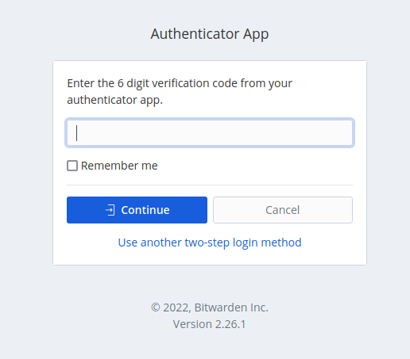
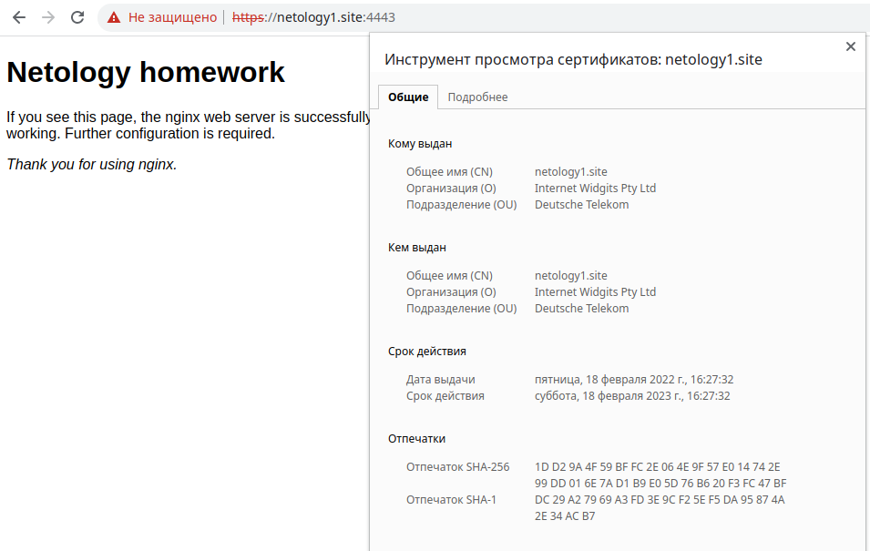
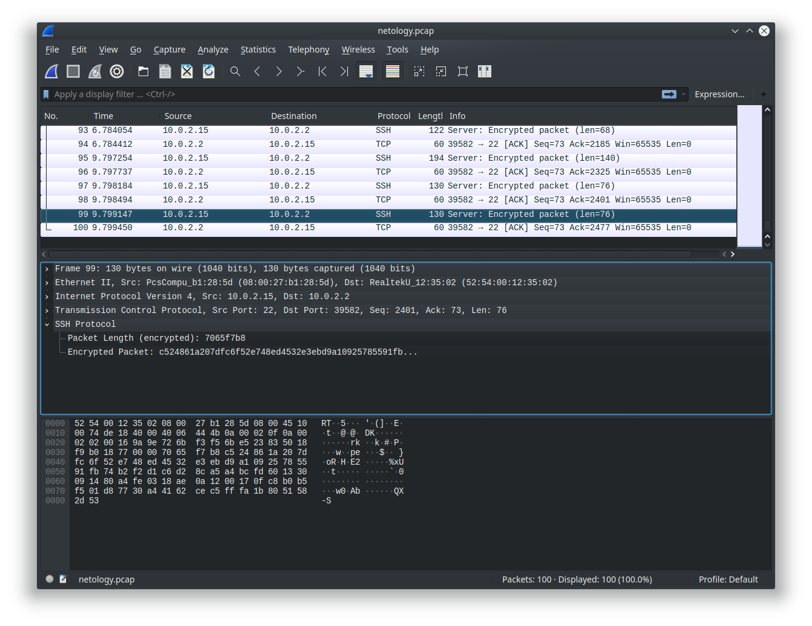

# Домашнее задание к занятию "3.9. Элементы безопасности информационных систем"


1. Установите Bitwarden плагин для браузера. Зарегестрируйтесь и сохраните несколько паролей.

Установил в браузере Mozilla Firefox, сохранил пароль для одного сайта.


### 2. Установите Google authenticator на мобильный телефон. Настройте вход в Bitwarden акаунт через Google authenticator OTP.

Настроил вход на https://vault.bitwarden.com/ через Google authenticator:



### 3. Установите apache2, сгенерируйте самоподписанный сертификат, настройте тестовый сайт для работы по HTTPS.

0. Делаем проброс портов в Vagrant'e:

````
...
  config.vm.network "forwarded_port", guest: 80,  host: 8080
  config.vm.network "forwarded_port", guest: 443, host: 4443
...
````
1. На виртуальной машине уже установлен nginx, используем его вместо apache
2. Создаём самоподписанный сертификат:
````
# openssl req -x509 -nodes -days 365 -newkey rsa:2048 -keyout /etc/ssl/private/nginx-selfsigned.key -out /etc/ssl/certs/nginx-selfsigned.crt
# openssl dhparam -out /etc/nginx/dhparam.pem 4096
````
3. Правим конфигурационные файлы nginx, тестируем их `nginx -t` и перезапускаем сервис:

````
root@vagrant:/etc/nginx/sites-enabled# cat default 


server {
        listen 80 default_server;
        listen [::]:80 default_server;


        # SSL configuration
        #
        listen 443 ssl default_server;
        listen [::]:443 ssl default_server;

        include snippets/ssl-selfsigned-certs.conf;
        include snippets/ssl-params.conf;

        server_name netology1.site www.netology1.site;
        root /var/www/site;

        index index.html;
 

        location / {
                # First attempt to serve request as file, then
                # as directory, then fall back to displaying a 404.
                try_files $uri $uri/ =404;
        }

        location ~ /\.ht {
                deny all;
        }
}
````

````
root@vagrant:/etc/nginx/snippets# cat ssl-params.conf 


ssl_protocols TLSv1.2;
ssl_prefer_server_ciphers on;
ssl_dhparam /etc/nginx/dhparam.pem;
ssl_ciphers ECDHE-RSA-AES256-GCM-SHA512:DHE-RSA-AES256-GCM-SHA512:ECDHE-RSA-AES256-GCM-SHA384:DHE-RSA-AES256-GCM-SHA384:ECDHE-RSA-AES256-SHA384;
ssl_ecdh_curve secp384r1; # Requires nginx >= 1.1.0
ssl_session_timeout  10m;
ssl_session_cache shared:SSL:10m;
ssl_session_tickets off; # Requires nginx >= 1.5.9
ssl_stapling on; # Requires nginx >= 1.3.7
ssl_stapling_verify on; # Requires nginx => 1.3.7
resolver 8.8.8.8 8.8.4.4 valid=300s;
resolver_timeout 5s;
# Disable strict transport security for now. You can uncomment the following
# line if you understand the implications.
# add_header Strict-Transport-Security "max-age=63072000; includeSubDomains; preload";
add_header X-Frame-Options DENY;
add_header X-Content-Type-Options nosniff;
add_header X-XSS-Protection "1; mode=block";
````

````
root@vagrant:/etc/nginx/snippets# cat ssl-selfsigned-certs.conf 


ssl_certificate /etc/ssl/certs/nginx-selfsigned.crt;
ssl_certificate_key /etc/ssl/private/nginx-selfsigned.key;
````

4. Чтобы открыть сайт по имени, прописываем в hosts на хостовой машине:

`127.0.0.1 netology1.site`

5. Смотрим на получившийся результат:




### 4. Проверьте на TLS уязвимости произвольный сайт в интернете (кроме сайтов МВД, ФСБ, МинОбр, НацБанк, РосКосмос, РосАтом, РосНАНО и любых госкомпаний, объектов КИИ, ВПК ... и тому подобное).

`$ ./testssl.sh -U --sneaky https://www.rusarmyexpo.ru/`

````
 Testing vulnerabilities 

 Heartbleed (CVE-2014-0160)                not vulnerable (OK), no heartbeat extension
 CCS (CVE-2014-0224)                       not vulnerable (OK)
 Ticketbleed (CVE-2016-9244), experiment.  not vulnerable (OK)
 ROBOT                                     Server does not support any cipher suites that use RSA key transport
 Secure Renegotiation (RFC 5746)           supported (OK)
 Secure Client-Initiated Renegotiation     not vulnerable (OK)
 CRIME, TLS (CVE-2012-4929)                not vulnerable (OK)
 BREACH (CVE-2013-3587)                    potentially NOT ok, "gzip" HTTP compression detected. - only supplied "/" tested
                                           Can be ignored for static pages or if no secrets in the page
 POODLE, SSL (CVE-2014-3566)               not vulnerable (OK)
 TLS_FALLBACK_SCSV (RFC 7507)              No fallback possible (OK), no protocol below TLS 1.2 offered
 SWEET32 (CVE-2016-2183, CVE-2016-6329)    not vulnerable (OK)
 FREAK (CVE-2015-0204)                     not vulnerable (OK)
 DROWN (CVE-2016-0800, CVE-2016-0703)      not vulnerable on this host and port (OK)
                                           make sure you don't use this certificate elsewhere with SSLv2 enabled services
                                           https://censys.io/ipv4?q=23D8948E275007FC01ABE6BBA6B564C7F4C50A952B9DC575FE3409371974C705 could help you to find out
 LOGJAM (CVE-2015-4000), experimental      not vulnerable (OK): no DH EXPORT ciphers, no common prime detected
 BEAST (CVE-2011-3389)                     not vulnerable (OK), no SSL3 or TLS1
 LUCKY13 (CVE-2013-0169), experimental     potentially VULNERABLE, uses cipher block chaining (CBC) ciphers with TLS. Check patches
 Winshock (CVE-2014-6321), experimental    not vulnerable (OK) - ARIA, CHACHA or CCM ciphers found
 RC4 (CVE-2013-2566, CVE-2015-2808)        no RC4 ciphers detected (OK)
````


### 5. Установите на Ubuntu ssh сервер, сгенерируйте новый приватный ключ. Скопируйте свой публичный ключ на другой сервер. Подключитесь к серверу по SSH-ключу.

`# apt install openssh-server`                                                                                                                          
                                                                                                
`# systemctl start sshd.service`

`# systemctl enable sshd.service`

````                                                                                                 
root@vagrant:~# systemctl status sshd                                                                                                                               
● ssh.service - OpenBSD Secure Shell server                                                                                                                         
     Loaded: loaded (/lib/systemd/system/ssh.service; enabled; vendor preset: enabled)                                                                              
     Active: active (running) since Fri 2022-02-18 12:32:38 UTC; 3h 27min ago                                                                                       
       Docs: man:sshd(8)                                                                                                                                            
             man:sshd_config(5)
    Process: 628 ExecStartPre=/usr/sbin/sshd -t (code=exited, status=0/SUCCESS)
   Main PID: 671 (sshd)
      Tasks: 1 (limit: 1071)
     Memory: 6.2M
     CGroup: /system.slice/ssh.service
             └─671 sshd: /usr/sbin/sshd -D [listener] 0 of 10-100 startups
````
             
````             
$ ssh-copy-id -i netology-lab -p2222 vagrant@localhost
/usr/bin/ssh-copy-id: INFO: Source of key(s) to be installed: "netology-lab.pub"
/usr/bin/ssh-copy-id: INFO: attempting to log in with the new key(s), to filter out any that are already installed
/usr/bin/ssh-copy-id: INFO: 1 key(s) remain to be installed -- if you are prompted now it is to install the new keys
````

````
$ ssh -i netology-lab -p2222 vagrant@localhost
Enter passphrase for key 'netology-lab': 
Welcome to Ubuntu 20.04.3 LTS (GNU/Linux 5.4.0-91-generic x86_64)

 * Documentation:  https://help.ubuntu.com
 * Management:     https://landscape.canonical.com
 * Support:        https://ubuntu.com/advantage

  System information as of Fri 18 Feb 2022 04:27:48 PM UTC

  System load:  0.0                Processes:             123
  Usage of /:   12.0% of 30.88GB   Users logged in:       1
  Memory usage: 19%                IPv4 address for eth0: 10.0.2.15
  Swap usage:   0%                 IPv4 address for eth1: 192.168.1.2


This system is built by the Bento project by Chef Software
More information can be found at https://github.com/chef/bento
Last login: Fri Feb 18 16:27:41 2022 from 10.0.2.2
````


### 6. Переименуйте файлы ключей из задания 5. Настройте файл конфигурации SSH клиента, так чтобы вход на удаленный сервер осуществлялся по имени сервера.

Добавляем в конфиг клиента ssh:

````
Host netology1
    HostName 127.0.0.1
    Port 2222
    User vagrant
    TCPKeepAlive yes
    IdentityFile ~/.ssh/netology-lab
````    

заходим на сервер:

````
$ ssh netology1
The authenticity of host '[127.0.0.1]:2222 ([127.0.0.1]:2222)' can't be established.
ECDSA key fingerprint is SHA256:RztZ38lZsUpiN3mQrXHa6qtsUgsttBXWJibL2nAiwdQ.
Are you sure you want to continue connecting (yes/no)? yes
Warning: Permanently added '[127.0.0.1]:2222' (ECDSA) to the list of known hosts.
Enter passphrase for key '/home/abs/.ssh/netology-lab': 
Welcome to Ubuntu 20.04.3 LTS (GNU/Linux 5.4.0-91-generic x86_64)

 * Documentation:  https://help.ubuntu.com
 * Management:     https://landscape.canonical.com
 * Support:        https://ubuntu.com/advantage

  System information as of Fri 18 Feb 2022 04:31:35 PM UTC

  System load:  0.0                Processes:             122
  Usage of /:   12.0% of 30.88GB   Users logged in:       1
  Memory usage: 19%                IPv4 address for eth0: 10.0.2.15
  Swap usage:   0%                 IPv4 address for eth1: 192.168.1.2
````


### 7. Соберите дамп трафика утилитой tcpdump в формате pcap, 100 пакетов. Откройте файл pcap в Wireshark.

````
# tcpdump -c 100 -w netology.pcap
tcpdump: listening on eth0, link-type EN10MB (Ethernet), capture size 262144 bytes
100 packets captured
104 packets received by filter
0 packets dropped by kernel
````




Задание для самостоятельной отработки (необязательно к выполнению)
### 8*. Просканируйте хост scanme.nmap.org. Какие сервисы запущены?


`# nmap -O -sS scanme.nmap.org`

````
Starting Nmap 7.60 ( https://nmap.org ) at 2022-02-18 12:37 MSK
Nmap scan report for scanme.nmap.org (45.33.32.156)
Host is up (0.18s latency).
Other addresses for scanme.nmap.org (not scanned): 2600:3c01::f03c:91ff:fe18:bb2f
Not shown: 992 closed ports
PORT      STATE    SERVICE
22/tcp    open     ssh
80/tcp    open     http
135/tcp   filtered msrpc
139/tcp   filtered netbios-ssn
445/tcp   filtered microsoft-ds
1025/tcp  filtered NFS-or-IIS
9929/tcp  open     nping-echo
31337/tcp open     Elite
Aggressive OS guesses: Linux 2.6.32 - 3.13 (93%), Linux 2.6.22 - 2.6.36 (92%), Linux 3.10 - 4.8 (91%), Linux 3.2 - 4.8 (91%), Linux 2.6.32 - 3.10 (91%), Linux 3.10 (90%), HP P2000 G3 NAS device (90%), Linux 2.6.26 - 2.6.35 (90%), Ubiquiti AirMax NanoStation WAP (Linux 2.6.32) (90%), Linux 2.6.18 (90%)
No exact OS matches for host (test conditions non-ideal).
Network Distance: 16 hops
````

Видим, что запущены сервисы: 
* SSH (22),
* WEB (80),
* различные сервисы Microsoft (135, 139, 445),
* 1025 порт - много вариантов: NFS, IIS, другой софт и трояны,
* 9929 - универсальный пинглер из пакета nmap, на порту 31337 возможно эмулируется троян.


### 9*. Установите и настройте фаервол ufw на web-сервер из задания 3. Откройте доступ снаружи только к портам 22,80,443

````
# ufw app list
Available applications:
  Nginx Full
  Nginx HTTP
  Nginx HTTPS
  OpenSSH
````  

````
# ufw status
Status: inactive
````

````
# ufw enable
Command may disrupt existing ssh connections. Proceed with operation (y|n)? y
Firewall is active and enabled on system startup
````

````
# ufw allow 'OpenSSH'
Rule added
Rule added (v6)
````

````
# ufw allow 'Nginx HTTP'
Rule added
Rule added (v6)
````

````
# ufw allow 'Nginx HTTPS'
Rule added
Rule added (v6)
````

Конечный результат:

````
# ufw status verbose
Status: active
Logging: on (low)
Default: deny (incoming), allow (outgoing), disabled (routed)
New profiles: skip

To                         Action      From
--                         ------      ----
22/tcp (OpenSSH)           ALLOW IN    Anywhere                  
80/tcp (Nginx HTTP)        ALLOW IN    Anywhere                  
443/tcp (Nginx HTTPS)      ALLOW IN    Anywhere                  
22/tcp (OpenSSH (v6))      ALLOW IN    Anywhere (v6)             
80/tcp (Nginx HTTP (v6))   ALLOW IN    Anywhere (v6)             
443/tcp (Nginx HTTPS (v6)) ALLOW IN    Anywhere (v6)
````
