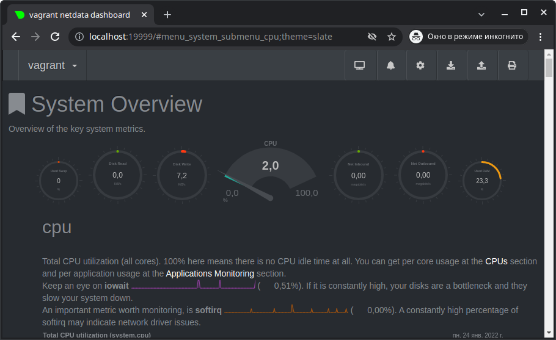

# Домашнее задание к занятию "3.4. Операционные системы, лекция 2"


###  1. На лекции мы познакомились с node_exporter. В демонстрации его исполняемый файл запускался в background. Этого достаточно для демо, но не для настоящей production-системы, где процессы должны находиться под внешним управлением. Используя знания из лекции по systemd, создайте самостоятельно простой unit-файл для node_exporter:

Создан unit-файл:
 
`root@vagrant:/etc/systemd/system# cat node-exporter.service`

    [Unit]
    Description=Prometheus exporter for machine metrics

    [Service]
    Restart=always
    User=prometheus
    EnvironmentFile=-/etc/default/node-exporter
    ExecStart=/usr/local/bin/node_exporter $NODE_EXPORTER_OPTS
    ExecReload=/bin/kill -HUP $MAINPID
    TimeoutStopSec=20s
    SendSIGKILL=no

    [Install]
    WantedBy=multi-user.target


поместите его в автозагрузку,

`# systemctl enable node-exporter.service`

предусмотрите возможность добавления опций к запускаемому процессу через внешний файл (посмотрите, например, на systemctl cat cron),

    EnvironmentFile=-/etc/default/node-exporter
    ExecStart=/usr/local/bin/node_exporter $NODE_EXPORTER_OPTS

`# cat /etc/default/node-exporter`

    # Default settings for node_exporter.

    # Options to pass to node_exporter
    NODE_EXPORTER_OPTS=


удостоверьтесь, что с помощью systemctl процесс корректно стартует, завершается, а после перезагрузки автоматически поднимается.

    root@vagrant:/etc/systemd/system# systemctl start node-exporter       
    root@vagrant:/etc/systemd/system# systemctl status node-exporter      
    ● node-exporter.service - Prometheus exporter for machine metrics
        Loaded: loaded (/etc/systemd/system/node-exporter.service; enabled; vendor preset: enabled)
        Active: active (running) since Mon 2022-01-24 07:17:47 UTC; 7s ago
     Main PID: 2007 (node_exporter)
        Tasks: 4 (limit: 1107)
        Memory: 2.4M
        CGroup: /system.slice/node-exporter.service
             └─2007 /usr/local/bin/node_exporter

    Jan 24 07:17:47 vagrant node_exporter[2007]: ts=2022-01-24T07:17:47.619Z caller=node_exporter.g>
    Jan 24 07:17:47 vagrant node_exporter[2007]: ts=2022-01-24T07:17:47.619Z caller=node_exporter.g>
    Jan 24 07:17:47 vagrant node_exporter[2007]: ts=2022-01-24T07:17:47.619Z caller=node_exporter.g>
    Jan 24 07:17:47 vagrant node_exporter[2007]: ts=2022-01-24T07:17:47.619Z caller=node_exporter.g>
    Jan 24 07:17:47 vagrant node_exporter[2007]: ts=2022-01-24T07:17:47.619Z caller=node_exporter.g>
    Jan 24 07:17:47 vagrant node_exporter[2007]: ts=2022-01-24T07:17:47.620Z caller=node_exporter.g>
    Jan 24 07:17:47 vagrant node_exporter[2007]: ts=2022-01-24T07:17:47.620Z caller=node_exporter.g>
    Jan 24 07:17:47 vagrant node_exporter[2007]: ts=2022-01-24T07:17:47.620Z caller=node_exporter.g>
    Jan 24 07:17:47 vagrant node_exporter[2007]: ts=2022-01-24T07:17:47.620Z caller=node_exporter.g>
    Jan 24 07:17:47 vagrant node_exporter[2007]: ts=2022-01-24T07:17:47.621Z caller=tls_config.go:1>


### 2. Ознакомьтесь с опциями node_exporter и выводом /metrics по-умолчанию. Приведите несколько опций, которые вы бы выбрали для базового мониторинга хоста по CPU, памяти, диску и сети.
   
    curl localhost:9100/metrics | grep node_cpu | more
    curl localhost:9100/metrics | grep node_memory | more
    curl localhost:9100/metrics | grep node_disk | more
    curl localhost:9100/metrics | grep node_network | more

   для базового мониторинга можно взять метрики:
   
    node_cpu_seconds_total
    node_memory_Buffers_bytes
    node_memory_Cached_bytes
    node_memory_MemAvailable_bytes
    node_memory_MemFree_bytes
    node_memory_MemTotal_bytes
    node_disk_io_now
    node_disk_read_time_seconds_total
    node_disk_reads_completed_total
    node_network_receive_bytes_total
    node_network_receive_packets_total
    node_network_transmit_errs_total
    node_network_receive_errs_total


### 3. Установите в свою виртуальную машину Netdata. Воспользуйтесь готовыми пакетами для установки (sudo apt install -y netdata). После успешной установки:

 - в конфигурационном файле /etc/netdata/netdata.conf в секции [web] замените значение с localhost на bind to = 0.0.0.0,
- добавьте в Vagrantfile проброс порта Netdata на свой локальный компьютер и сделайте vagrant reload:
config.vm.network "forwarded_port", guest: 19999, host: 19999

 При старте Вагранта видим проброс:

    ==> default: Forwarding ports...
        default: 19999 (guest) => 19999 (host) (adapter 1)
        default: 22 (guest) => 2222 (host) (adapter 1)

 После успешной перезагрузки в браузере на своем ПК (не в виртуальной машине) вы должны суметь зайти на localhost:19999.
  Ознакомьтесь с метриками, которые по-умолчанию собираются Netdata и с комментариями, которые даны к этим метрикам.



### 4. Можно ли по выводу dmesg понять, осознает ли ОС, что загружена не на настоящем оборудовании, а на системе виртуализации?

  Да, "осознаёт":
```
# dmesg | grep -i virtual
[    0.000000] DMI: innotek GmbH VirtualBox/VirtualBox, BIOS VirtualBox 12/01/2006
[    0.003193] CPU MTRRs all blank - virtualized system.
[    0.161937] Booting paravirtualized kernel on KVM
[    1.628456] [drm] VirtualBox host is too old, no cursor support
[    3.526293] systemd[1]: Detected virtualization oracle.
```

### 5. Как настроен sysctl fs.nr_open на системе по-умолчанию? Узнайте, что означает этот параметр. Какой другой существующий лимит не позволит достичь такого числа (ulimit --help)?

 `fs.nr_open` - максимальное число файловых дескрипторов, которые может открыть процесс.
По-умолчанию значение:
```
$ sysctl fs.nr_open
fs.nr_open = 1048576
```
Другой лимит: `ulimit -n`

-n        the maximum number of open file descriptors
```
$ ulimit -n
1024
```

### 6. Запустите любой долгоживущий процесс (не ls, который отработает мгновенно, а, например, sleep 1h) в отдельном неймспейсе процессов; покажите, что ваш процесс работает под PID 1 через nsenter. Для простоты работайте в данном задании под root (sudo -i). Под обычным пользователем требуются дополнительные опции (--map-root-user) и т.д.
```
root@vagrant:~# unshare --mount-proc --fork --pid ping localhost 2>&1 > /dev/null &
[1] 2250
root@vagrant:~# ps -ax | grep ping
   2250 pts/1    S      0:00 unshare --mount-proc --fork --pid ping localhost
   2251 pts/1    S      0:00 ping localhost
   2253 pts/1    S+     0:00 grep --color=auto ping
root@vagrant:~# nsenter --target 2251 --pid --mount
root@vagrant:/# ps -ax | grep ping
      1 pts/1    S      0:00 ping localhost
     14 pts/1    S+     0:00 grep --color=auto ping
```


### 7. Найдите информацию о том, что такое :(){ :|:& };:. Запустите эту команду в своей виртуальной машине Vagrant с Ubuntu 20.04 (это важно, поведение в других ОС не проверялось). Некоторое время все будет "плохо", после чего (минуты) – ОС должна стабилизироваться. Вызов dmesg расскажет, какой механизм помог автоматической стабилизации. Как настроен этот механизм по-умолчанию, и как изменить число процессов, которое можно создать в сессии?

`:(){ :|:& };:` - Функция, которая рекурсивно вызывает по 2 экземпляра себя. Так называемая, Форк-бомба. При отсутствии ограничения на число процессов машина быстро исчерпывает физическую память и своп.

В dmesg находим строку:

    [Mon Jan 24 08:16:20 2022] cgroup: fork rejected by pids controller in /user.slice/user-1000.slice/session-3.scope

Systemd для каждого пользователя создает cgroup и помещает туда все запускаемые им процессы. Этот механизм ограничивает использование системных ресурсов, в том числе максимальное число процессов.

Изменить ограничение на число процессов можно через unit:

    # systemctl set-property user-$UID.slice TasksMax=90%

Будет создан юнит для пользователя с uid и заданными настроками, который будет использоваться вместо дефолтного.

В абсолютных величинах это будет:

    $ sysctl kernel.threads-max
    kernel.threads-max = 7383

90% от 7383 = 6644

