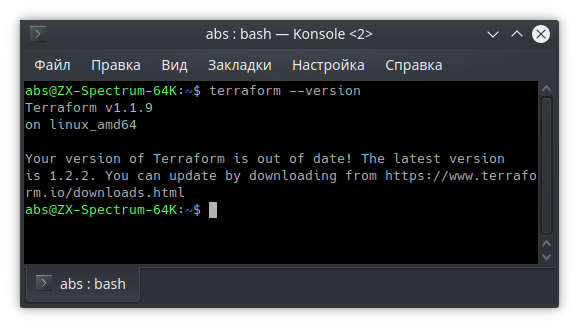
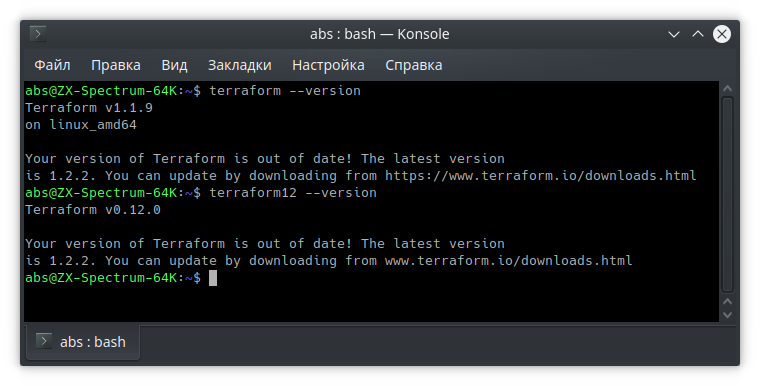

# Домашнее задание к занятию "7.1. Инфраструктура как код"

## Задача 1. Выбор инструментов. 
 
### В результате задачи необходимо

1. Ответить на четыре вопроса представленных в разделе "Легенда". 

>1. Какой тип инфраструктуры будем использовать для этого проекта: изменяемый или не изменяемый?
> 
> - Уточнить на совещании: этот клиент - банк? Если банк, то неизменяемая, в остальных случаях - изменяемая. 

>2. Будет ли центральный сервер для управления инфраструктурой?
> 
> - Уточнить на совещании: будет ли использоваться какая-то инфраструктура клиента с узкими каналами и высокой загрузкой?
> Если вся инфраструктура наша (железо, каналы), то без центрального сервера, а если в тайге буровое оборудование со спутниковым интернетом или ADSL, то лучше с центральным сервером и агентами, чтобы планировать обновления в минимумы загрузки каналов. 

>3. Будут ли агенты на серверах?
> 
>  Ответ вытекает из уточнений по второму вопросу.

>4. Будут ли использованы средства для управления конфигурацией или инициализации ресурсов?
>
>  Однозначно будут, это позволит сделать одинаковыми среды у разработчиков, в тесте и в проде.
 
 
2. Какие инструменты из уже используемых вы хотели бы использовать для нового проекта? 
 
> Packer, Terraform, Docker, Kubernetes, Ansible, Teamcity
> 

3. Хотите ли рассмотреть возможность внедрения новых инструментов для этого проекта? 

> Обязательно буду рассматривать любые инструменты, ускоряющие и облегчающие процесс разработки, тестирования и выкатки проекта.

## Задача 2. Установка терраформ. 

## Задача 3. Поддержка легаси кода. 

