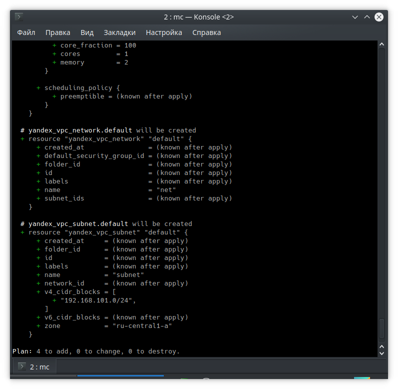

# Домашнее задание к занятию "7.2. Облачные провайдеры и синтаксис Терраформ."

## Задача 1. (Вариант с Yandex.Cloud). Регистрация в ЯО и знакомство с основами (необязательно, но крайне желательно).

> Зарегистрировался
> 
> Ознакомился
> 
> Чтобы не указывать авторизационный токен в коде будем использовать переменную окружения

## Задача 2. Создание yandex_compute_instance через терраформ.

> `terraform plan` выполнился без ошибок

В качестве результата задания предоставьте:
1. Ответ на вопрос: при помощи какого инструмента (из разобранных на прошлом занятии) можно создать свой образ ami?
> Packer
 
 
2. Ссылку на репозиторий с исходной конфигурацией терраформа.
> Исходная конфигурация [добавлена](terraform)
 
