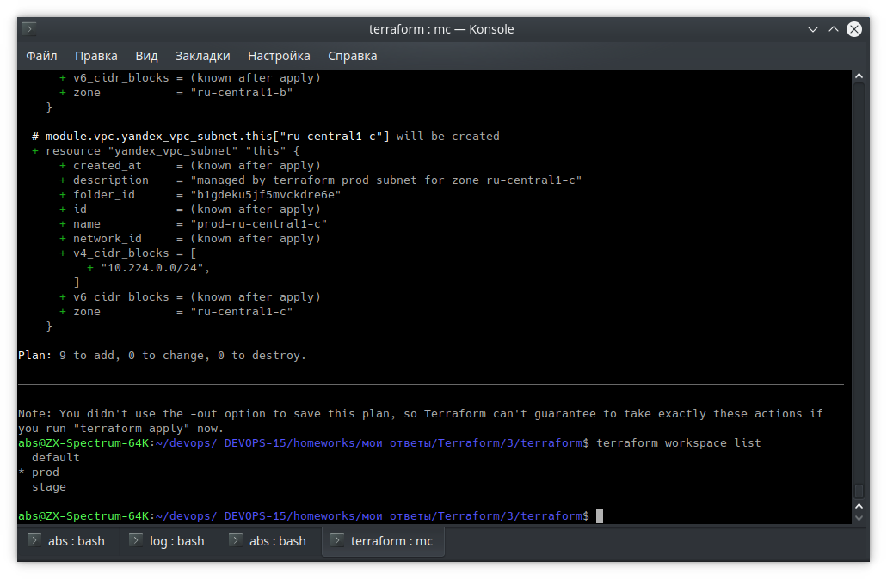

# Домашнее задание к занятию "7.3. Основы и принцип работы Терраформ"

## Задача 1. Создадим бэкэнд в S3 (необязательно, но крайне желательно).

> не удалось выполнить

## Задача 2. Инициализируем проект и создаем воркспейсы. 




В виде результата работы пришлите:
* Вывод команды `terraform workspace list`.
````shell
abs@ZX-Spectrum-64K:~/devops/_DEVOPS-15/homeworks/мои_ответы/Terraform/3/terraform$ terraform workspace list
  default
* prod
  stage
````

* Вывод команды `terraform plan` для воркспейса `prod`. 

````bash
abs@ZX-Spectrum-64K:~/devops/_DEVOPS-15/homeworks/мои_ответы/Terraform/3/terraform$ terraform plan
module.vpc.data.yandex_compute_image.nat_instance: Reading...
module.vpc.data.yandex_compute_image.nat_instance: Read complete after 2s [id=fd8uj8cu5v8u8kfnosb4]

Terraform used the selected providers to generate the following execution plan. Resource actions are indicated with the
following symbols:
  + create
 <= read (data resources)

Terraform will perform the following actions:

  # yandex_compute_image.image will be created
  + resource "yandex_compute_image" "image" {
      + created_at      = (known after apply)
      + family          = "centos-8"
      + folder_id       = (known after apply)
      + id              = (known after apply)
      + min_disk_size   = (known after apply)
      + os_type         = (known after apply)
      + product_ids     = (known after apply)
      + size            = (known after apply)
      + source_disk     = (known after apply)
      + source_family   = (known after apply)
      + source_image    = (known after apply)
      + source_snapshot = (known after apply)
      + source_url      = (known after apply)
      + status          = (known after apply)
    }

  # yandex_vpc_network.default will be created
  + resource "yandex_vpc_network" "default" {
      + created_at                = (known after apply)
      + default_security_group_id = (known after apply)
      + folder_id                 = (known after apply)
      + id                        = (known after apply)
      + name                      = "net"
      + subnet_ids                = (known after apply)
    }

  # yandex_vpc_subnet.default will be created
  + resource "yandex_vpc_subnet" "default" {
      + created_at     = (known after apply)
      + folder_id      = (known after apply)
      + id             = (known after apply)
      + name           = "subnet"
      + network_id     = (known after apply)
      + v4_cidr_blocks = [
          + "192.168.101.0/24",
        ]
      + v6_cidr_blocks = (known after apply)
      + zone           = "ru-central1-a"
    }

  # module.vm.data.yandex_compute_image.image will be read during apply
  # (depends on a resource or a module with changes pending)
 <= data "yandex_compute_image" "image" {
      + created_at    = (known after apply)
      + description   = (known after apply)
      + family        = "centos-8"
      + folder_id     = (known after apply)
      + id            = (known after apply)
      + image_id      = (known after apply)
      + labels        = (known after apply)
      + min_disk_size = (known after apply)
      + name          = (known after apply)
      + os_type       = (known after apply)
      + product_ids   = (known after apply)
      + size          = (known after apply)
      + status        = (known after apply)
    }

  # module.vm.yandex_compute_instance.instance[0] will be created
  + resource "yandex_compute_instance" "instance" {
      + created_at                = (known after apply)
      + description               = "Test Vm"
      + folder_id                 = "b1gdeku5jf5mvckdre6e"
      + fqdn                      = (known after apply)
      + hostname                  = "vm-1"
      + id                        = (known after apply)
      + metadata                  = {
          + "ssh-keys" = <<-EOT
                centos:ssh-rsa AAAAB3NzaC1yc2EAAAADAQABAAACAQCVShdqDp5wQ1GPP17BPek68LNzqlxd26CCbOLbsTxfGBKVzwyuDYfo7AM/du3cR0dBfL8irvFX31DYiBD+6fWJPW8wwhg5kM05IapCb074SXJarkKN98gTqb7gaiuhMpEMvb+qHxtOv1MSmoa7I1xoHxQtxjSVe3CdGKSwWSmRNPZ8kymORV4qOrcWZaUJ4UW9uJvD/28hASu2AmE1/3Y7qirg5OyhcBG7lfzN0yMldcWe/ieyc5//o9NZH0f9GYHl/uiS9BtzsI8oZSgkg1dKBawHD2KFWUL6YahFapmEkR7rsI4gz2whu+/JHktlN9xFgegsOZS+8HYS9vEQWVcYOlEWjswsBoos8v0sK3dTNeujjUY6v2vqGI5ZfxMYO1E4AmEJL/JRFv9CA6uYY8QnZ5+9sN7nyjtH8jTcyeURyfw/joCe0nY54GkRa+GIATl6f7b3UzhYr5trq4fice/ejzvRpO285OfX8Ynj09q8AYZynMtZoZ1rpl/3lxZTVuFm2ybLGXgpSsPC+58KE4xM4TTiByejIhGJV2jFf598gCiTpmx/KcguHfU8qA4Pxe2j1j9u3Utnx1aqARsa3K3nlYxihHKehesP2J9+0mpwNJ6CDtyOti3vXOU41uhjDQyBkjcPLfBeVVfIKJ/lOxWSMhIAtjFgud8PzmU7CSArfw== 
            EOT
        }
      + name                      = "vm-1"
      + network_acceleration_type = "standard"
      + platform_id               = "standard-v2"
      + service_account_id        = (known after apply)
      + status                    = (known after apply)
      + zone                      = "ru-central1-a"

      + boot_disk {
          + auto_delete = true
          + device_name = (known after apply)
          + disk_id     = (known after apply)
          + mode        = (known after apply)

          + initialize_params {
              + description = (known after apply)
              + image_id    = (known after apply)
              + name        = (known after apply)
              + size        = 40
              + snapshot_id = (known after apply)
              + type        = "network-ssd"
            }
        }

      + network_interface {
          + index              = (known after apply)
          + ip_address         = (known after apply)
          + ipv4               = true
          + ipv6               = (known after apply)
          + ipv6_address       = (known after apply)
          + mac_address        = (known after apply)
          + nat                = true
          + nat_ip_address     = (known after apply)
          + nat_ip_version     = (known after apply)
          + security_group_ids = (known after apply)
          + subnet_id          = (known after apply)
        }

      + placement_policy {
          + placement_group_id = (known after apply)
        }

      + resources {
          + core_fraction = 100
          + cores         = 2
          + memory        = 2
        }

      + scheduling_policy {
          + preemptible = (known after apply)
        }
    }

  # module.vm.yandex_compute_instance.instance[1] will be created
  + resource "yandex_compute_instance" "instance" {
      + created_at                = (known after apply)
      + description               = "Test Vm"
      + folder_id                 = "b1gdeku5jf5mvckdre6e"
      + fqdn                      = (known after apply)
      + hostname                  = "vm-2"
      + id                        = (known after apply)
      + metadata                  = {
          + "ssh-keys" = <<-EOT
                centos:ssh-rsa AAAAB3NzaC1yc2EAAAADAQABAAACAQCVShdqDp5wQ1GPP17BPek68LNzqlxd26CCbOLbsTxfGBKVzwyuDYfo7AM/du3cR0dBfL8irvFX31DYiBD+6fWJPW8wwhg5kM05IapCb074SXJarkKN98gTqb7gaiuhMpEMvb+qHxtOv1MSmoa7I1xoHxQtxjSVe3CdGKSwWSmRNPZ8kymORV4qOrcWZaUJ4UW9uJvD/28hASu2AmE1/3Y7qirg5OyhcBG7lfzN0yMldcWe/ieyc5//o9NZH0f9GYHl/uiS9BtzsI8oZSgkg1dKBawHD2KFWUL6YahFapmEkR7rsI4gz2whu+/JHktlN9xFgegsOZS+8HYS9vEQWVcYOlEWjswsBoos8v0sK3dTNeujjUY6v2vqGI5ZfxMYO1E4AmEJL/JRFv9CA6uYY8QnZ5+9sN7nyjtH8jTcyeURyfw/joCe0nY54GkRa+GIATl6f7b3UzhYr5trq4fice/ejzvRpO285OfX8Ynj09q8AYZynMtZoZ1rpl/3lxZTVuFm2ybLGXgpSsPC+58KE4xM4TTiByejIhGJV2jFf598gCiTpmx/KcguHfU8qA4Pxe2j1j9u3Utnx1aqARsa3K3nlYxihHKehesP2J9+0mpwNJ6CDtyOti3vXOU41uhjDQyBkjcPLfBeVVfIKJ/lOxWSMhIAtjFgud8PzmU7CSArfw== 
            EOT
        }
      + name                      = "vm-2"
      + network_acceleration_type = "standard"
      + platform_id               = "standard-v2"
      + service_account_id        = (known after apply)
      + status                    = (known after apply)
      + zone                      = "ru-central1-a"

      + boot_disk {
          + auto_delete = true
          + device_name = (known after apply)
          + disk_id     = (known after apply)
          + mode        = (known after apply)

          + initialize_params {
              + description = (known after apply)
              + image_id    = (known after apply)
              + name        = (known after apply)
              + size        = 40
              + snapshot_id = (known after apply)
              + type        = "network-ssd"
            }
        }

      + network_interface {
          + index              = (known after apply)
          + ip_address         = (known after apply)
          + ipv4               = true
          + ipv6               = (known after apply)
          + ipv6_address       = (known after apply)
          + mac_address        = (known after apply)
          + nat                = true
          + nat_ip_address     = (known after apply)
          + nat_ip_version     = (known after apply)
          + security_group_ids = (known after apply)
          + subnet_id          = (known after apply)
        }

      + placement_policy {
          + placement_group_id = (known after apply)
        }

      + resources {
          + core_fraction = 100
          + cores         = 2
          + memory        = 2
        }

      + scheduling_policy {
          + preemptible = (known after apply)
        }
    }

  # module.vpc.yandex_vpc_network.this will be created
  + resource "yandex_vpc_network" "this" {
      + created_at                = (known after apply)
      + default_security_group_id = (known after apply)
      + description               = "managed by terraform prod network"
      + folder_id                 = "b1gdeku5jf5mvckdre6e"
      + id                        = (known after apply)
      + name                      = "prod"
      + subnet_ids                = (known after apply)
    }

  # module.vpc.yandex_vpc_subnet.this["ru-central1-a"] will be created
  + resource "yandex_vpc_subnet" "this" {
      + created_at     = (known after apply)
      + description    = "managed by terraform prod subnet for zone ru-central1-a"
      + folder_id      = "b1gdeku5jf5mvckdre6e"
      + id             = (known after apply)
      + name           = "prod-ru-central1-a"
      + network_id     = (known after apply)
      + v4_cidr_blocks = [
          + "10.222.0.0/24",
        ]
      + v6_cidr_blocks = (known after apply)
      + zone           = "ru-central1-a"
    }

  # module.vpc.yandex_vpc_subnet.this["ru-central1-b"] will be created
  + resource "yandex_vpc_subnet" "this" {
      + created_at     = (known after apply)
      + description    = "managed by terraform prod subnet for zone ru-central1-b"
      + folder_id      = "b1gdeku5jf5mvckdre6e"
      + id             = (known after apply)
      + name           = "prod-ru-central1-b"
      + network_id     = (known after apply)
      + v4_cidr_blocks = [
          + "10.223.0.0/24",
        ]
      + v6_cidr_blocks = (known after apply)
      + zone           = "ru-central1-b"
    }

  # module.vpc.yandex_vpc_subnet.this["ru-central1-c"] will be created
  + resource "yandex_vpc_subnet" "this" {
      + created_at     = (known after apply)
      + description    = "managed by terraform prod subnet for zone ru-central1-c"
      + folder_id      = "b1gdeku5jf5mvckdre6e"
      + id             = (known after apply)
      + name           = "prod-ru-central1-c"
      + network_id     = (known after apply)
      + v4_cidr_blocks = [
          + "10.224.0.0/24",
        ]
      + v6_cidr_blocks = (known after apply)
      + zone           = "ru-central1-c"
    }

Plan: 9 to add, 0 to change, 0 to destroy.

────────────────────────────────────────────────────────────────────────────────────────────────────────────────────────

Note: You didn't use the -out option to save this plan, so Terraform can't guarantee to take exactly these actions if
you run "terraform apply" now.

````

