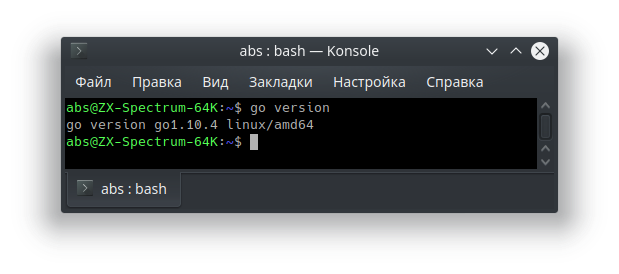
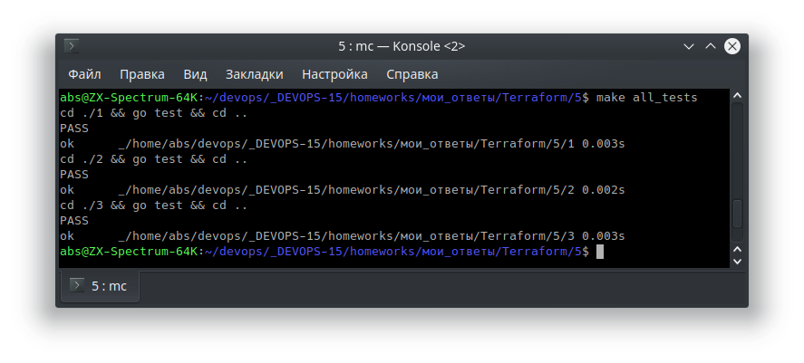

# Домашнее задание к занятию "7.5. Основы golang"

## Задача 1. Установите golang.

Golang установлен:

## Задача 2. Знакомство с gotour.

> Ознакомился

## Задача 3. Написание кода. 

1. Напишите программу для перевода метров в футы (1 фут = 0.3048 метр). Можно запросить исходные данные 
у пользователя, а можно статически задать в коде.

> [ссылка на код](./1/converter.go)
 
2. Напишите программу, которая найдет наименьший элемент в любом заданном списке, например:

> [ссылка на код](./2/get_min.go)

3. Напишите программу, которая выводит числа от 1 до 100, которые делятся на 3. То есть `(3, 6, 9, …)`.

> [ссылка на код](./3/filter.go)

## Задача 4. Протестировать код (не обязательно).

Тесты отработали:

> [Тест для задачи 3.1](./1/converter_test.go)

> [Тест для задачи 3.2](./2/get_min_test.go)

> [Тест для задачи 3.3](./3/filter_test.go)

 
