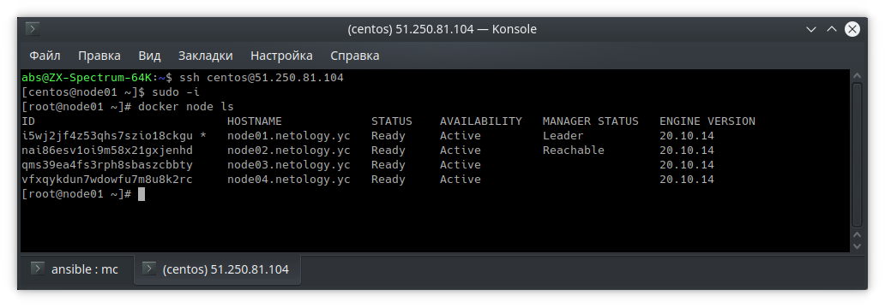
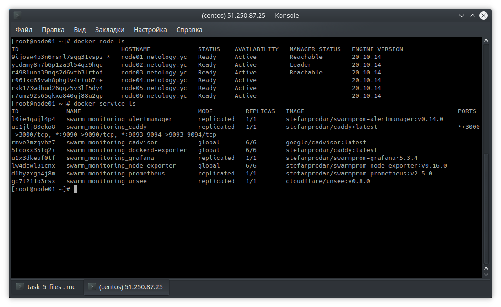
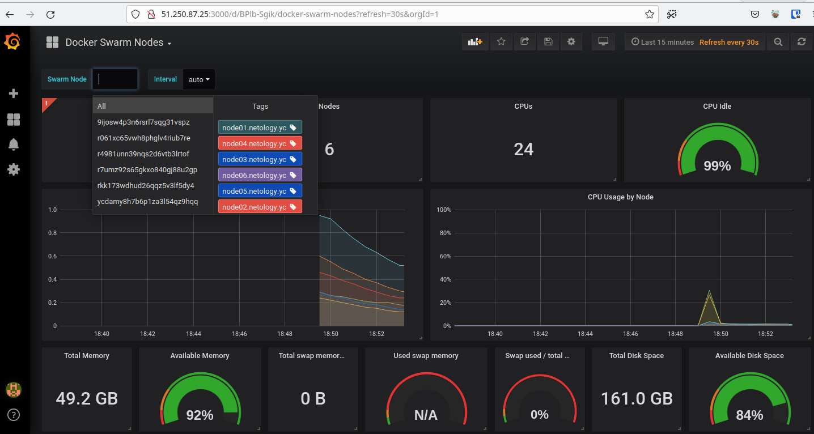
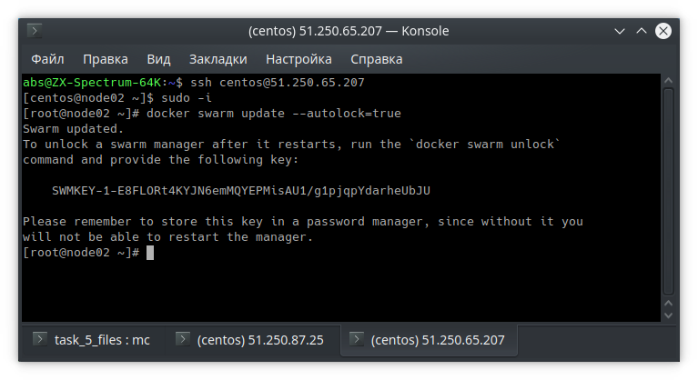

# Домашнее задание к занятию "5.5. Оркестрация кластером Docker контейнеров на примере Docker Swarm"

## Задача 1

Дайте письменные ответы на следующие вопросы:

- В чём отличие режимов работы сервисов в Docker Swarm кластере: replication и global?
> В режиме replication Docker Swarm обеспечивает работу сервиса на заданном количестве нод: мониторит их состояние и если нода отвалилась - запускает на другой.
> В режиме global - сервисы автоматически раскатываются по всем рабочим нодам кластера.

- Какой алгоритм выбора лидера используется в Docker Swarm кластере?
> Алгоритм распределённого консенсуса Raft

- Что такое Overlay Network?
> Overlay Network создает подсеть, которую контейнеры на разных хостах swarm-кластера используют для обмена данными. Применяется технология vxlan (инкапсуляция фреймы 2-го уровня в пакеты 4 уровня (UDP/IP). Получается одна общая виртуальная сеть поверх существующей физической сети, о которой нам ничего знать не надо.


## Задача 2

Создать ваш первый Docker Swarm кластер в Яндекс.Облаке

Для получения зачета, вам необходимо предоставить скриншот из терминала (консоли), с выводом команды:
```
docker node ls
```

Ответ:



## Задача 3

Создать ваш первый, готовый к боевой эксплуатации кластер мониторинга, состоящий из стека микросервисов.

Для получения зачета, вам необходимо предоставить скриншот из терминала (консоли), с выводом команды:
```
docker service ls
```

Ответ:



## Задача 4 (*)

Выполнить на лидере Docker Swarm кластера команду (указанную ниже) и дать письменное описание её функционала, что она делает и зачем она нужна:
```
# см.документацию: https://docs.docker.com/engine/swarm/swarm_manager_locking/
docker swarm update --autolock=true
```
Ответ:
>Включает автоматическую блокировку кластера и не даёт управлять им, конфигурациями сервисов и их данными, изменять состав кластера без дополнительного ключа. Это защита на случай получения злоумышленником доступа к зашифрованным Raft-логам.
>Другими словами, чтобы вернуть ноду в кластер (или вывести из него) нам надо предъявить сгенерированный при блокировке ключ.




